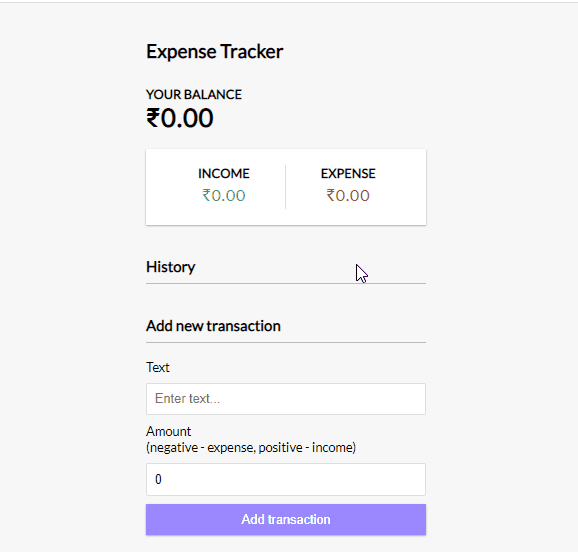

# Expense Tracker (MERN)
live app : https://expense-tracker-gjm.herokuapp.com/
> Full stack expense tracker

## Usage

```
add a config.env file with PORT , NODE_ENV , MONGODB URI
```
packages used
front end :<br/>
react <br/>
hooks<br/>
context api<br/>


backend:<br/>
express<br/>
mongoose<br/>
morgan<br/>
dotenv<br/>

dev dependencies:<br/>
colors<br/>
nodemon<br/>
concurrently<br/>
```
 npm install
 cd client npm install
 cd ..
 
 # Run front and backend
 npm run dev
 
 # Backend only
 npm run server
 
 # Frontend only
 npm run client
 
 # Build client
 cd client
 npm run build
 
 # Prod
 npm start
```
